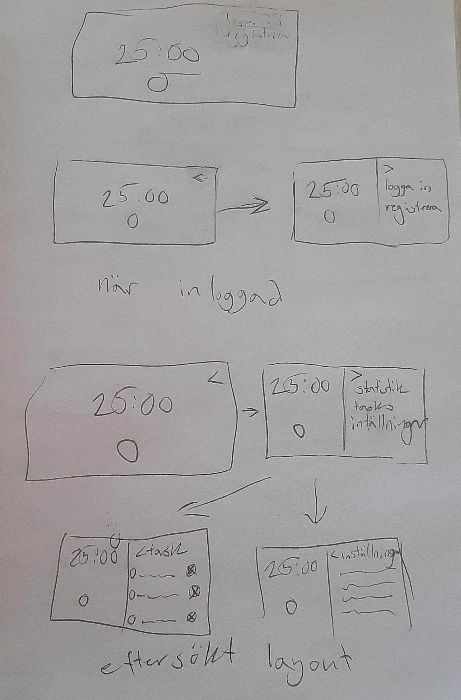
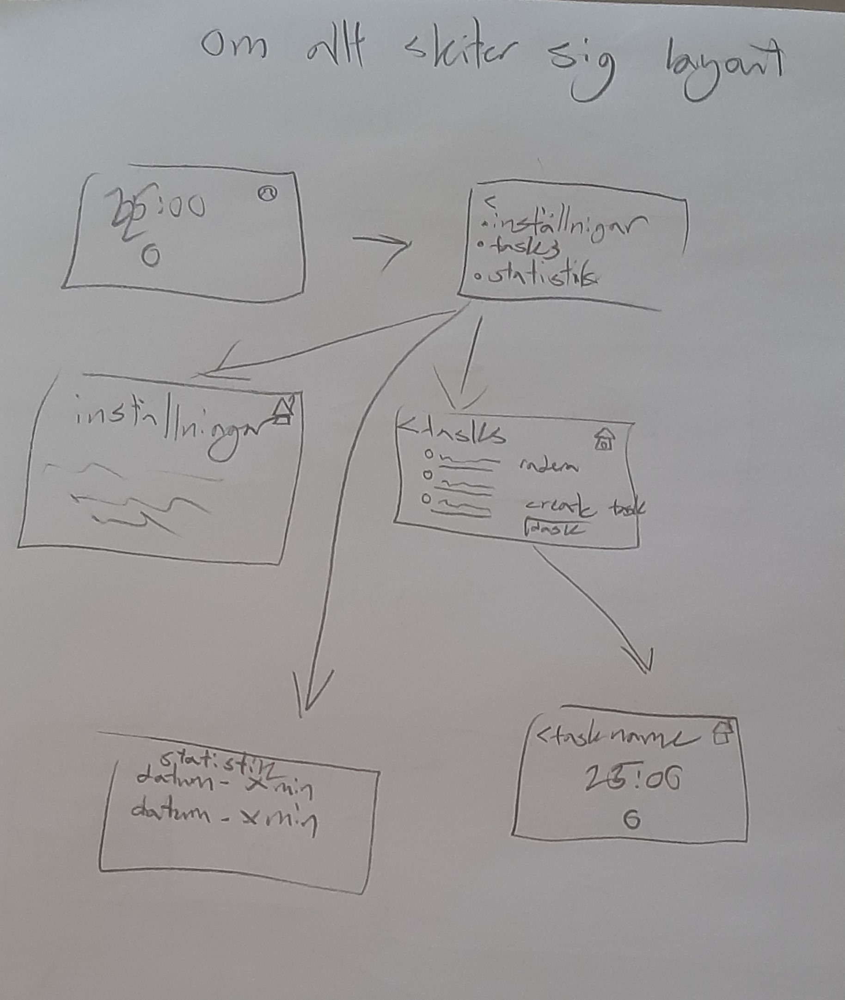
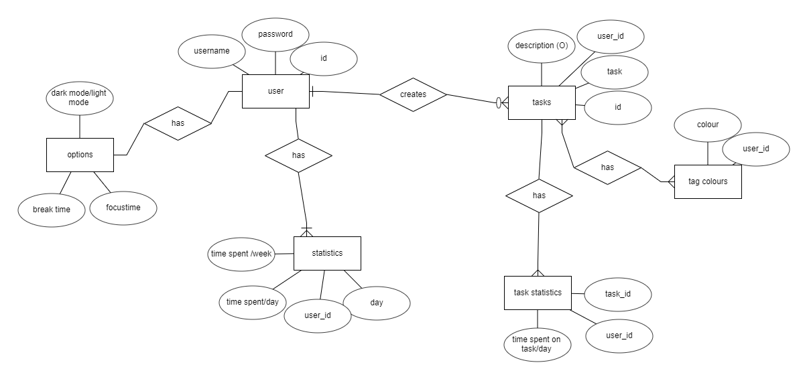

# Projektplan

## 1. Projektbeskrivning (Beskriv vad sidan ska kunna göra).
Jag skall göra en promodoro hemsida för datorn. hemsidan skall kunna vara en simpel nedräknare om man inte skapar ett konto. Om ett konto skapas skall applikationen spara hur lång tid du har fokuserat per dag. Användare skall också kunna göra tasks skall kunna läggas ned specifika fokus tider på. Dessa task fokustider skall då också ha seperata statistiker på hur mycket tid lades ned på en task. tasken skall också enkelt kunnas klassas som klara och tas bort, men inte statistiken för dem.
## 2. Vyer (visa bildskisser på dina sidor).

## 3. Databas med ER-diagram (Bild på ER-diagram).

## 4. Arkitektur (Beskriv filer och mappar - vad gör/innehåller de?).

- nedräknings timer
- länkar till alla andra sidor

- sida för inlogg och

- kan ändra tidsinställningar för användaren

- skapa tasks
- radera tasks
- ändra på tasks
- beräknar hur mycket fokus tid som spenderas på specifika tasks
- ger tasksen färger

- visar hur mycket tid per dag som man använt fokus timern

